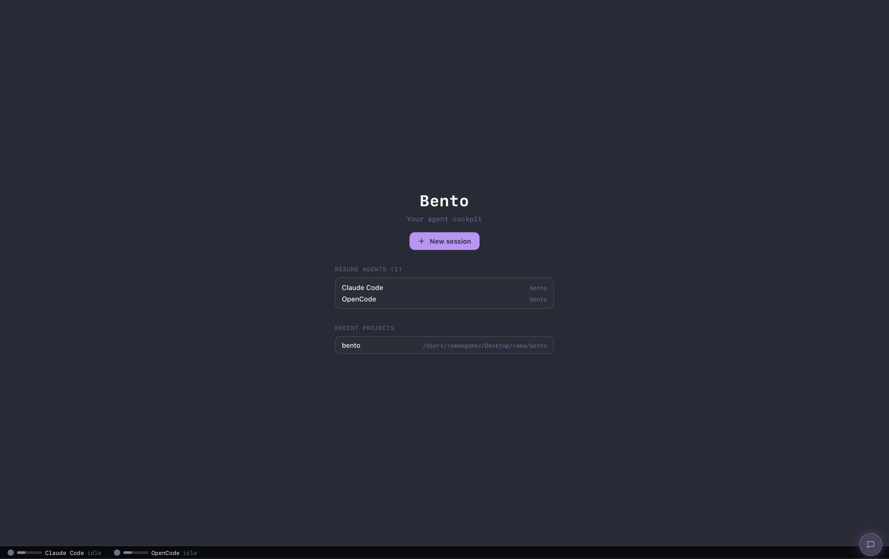
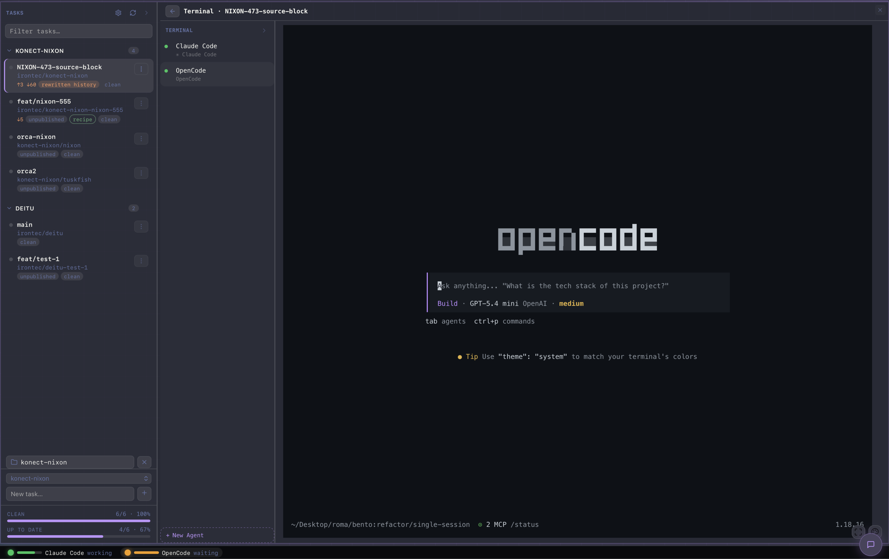
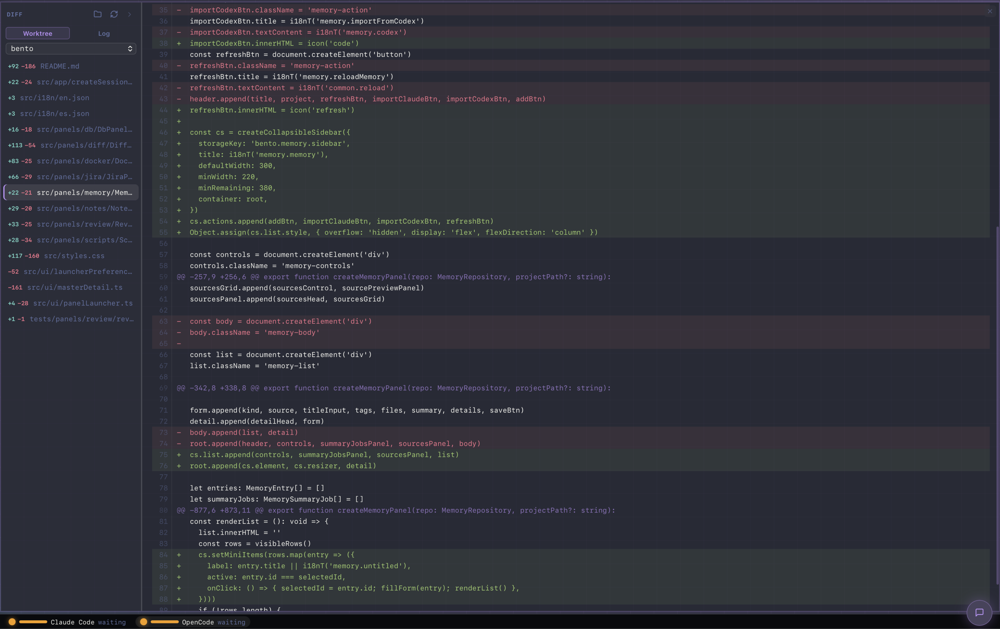
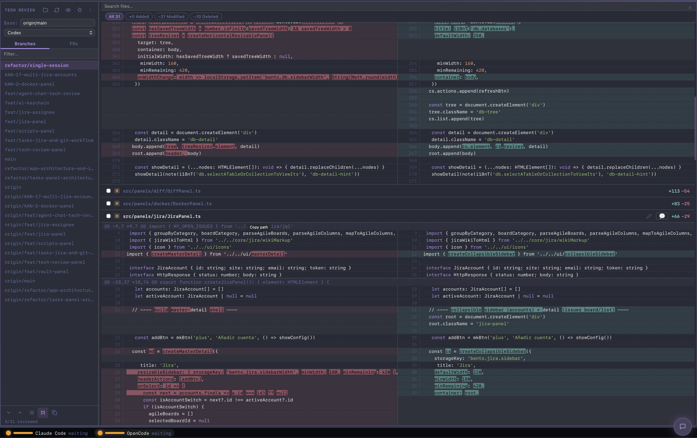
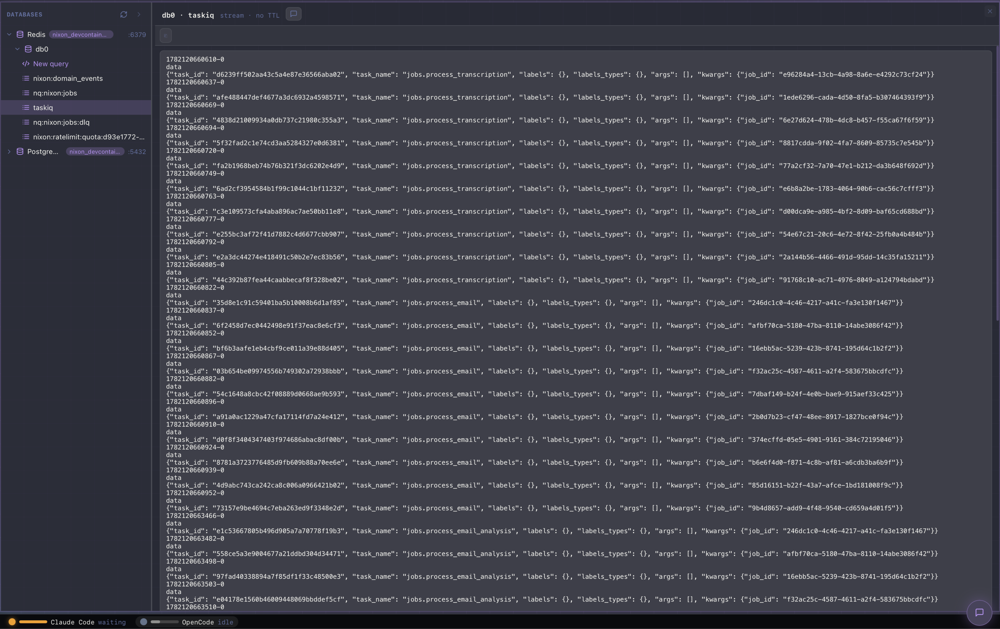
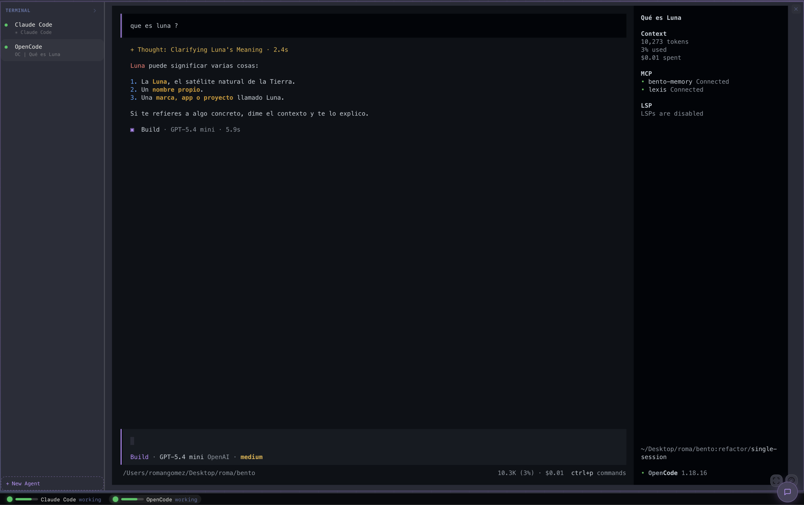

# Bento

**Bento** is an open-source developer cockpit built with Tauri. A modular desktop workspace where you can open and arrange developer panels — Git worktrees, terminals, code review, databases, containers, scripts, and more — side by side, with a persistent layout that survives restarts.

Runs natively on **macOS, Linux, and Windows**.

---



<details>
<summary>More screenshots</summary>







</details>

---

## Panels

| Panel | What it does |
|-------|-------------|
| **Tasks** | Git worktrees per task — branch, changes, commit, PR, rebase, merge. Linear integration. Multi-repo. Docker devcontainer support. |
| **Terminal** | Real shell via xterm.js + PTY. Multiple terminals, profiles, themes, search, zoom, cwd restore on reopen. Terminals survive app restarts — they live in the background daemon. |
| **Tech Review** | AI-assisted code review. Set a base branch, browse changed files, open PRs, diff split/tree view, inline comments, chat with an AI agent. |
| **Diff** | Browse Git history or worktree changes. File list on the left, rendered patch on the right. Grouped log view per commit. |
| **DB** | Database explorer. Connect to SQLite, PostgreSQL, MySQL. Tree view of schemas and tables, query editor with results. |
| **Docker** | Container manager grouped by project. Start/stop individual containers or entire project groups. Logs and terminal per container. |
| **Jira** | Jira board inside Bento. Multiple accounts, board view, backlog, issue search, create and edit issues. |
| **Scripts** | Script runner. Scan folders for shell scripts, run them in an embedded terminal. Filter by folder. |
| **Notes** | Markdown notes as `.md` files. Categories, tags, preview, Ask-AI from sidebar. |
| **HTTP** | REST client. Methods, headers, body (JSON, form, raw), saved collections. Imports OpenAPI / Swagger specs as a browsable collection. |
| **TV** | IPTV player with HLS.js. M3U channel list (iptv-org), favourites, YouTube/Twitch embeds. |
| **Web** | Embedded browser (native WebView). Bookmarks and history per project. |
| **Phone Remote** | Control any terminal from your phone over Wi-Fi or Tailscale. Toggle a token-gated HTTP server, scan the QR code on your phone — full xterm.js with arrow keys, reconnect and resize. Optional Tailscale mode for remote access outside your local network. |

---

## Agent Integration

Bento detects running AI agent sessions (Claude Code, Codex, OpenCode) and shows their status in the sidebar. When you reopen a workspace, agents that were running are automatically resumed — no copy-pasting session IDs.

Session detection and resume:
- **Claude Code** — herdr IPC socket reports the session ID; `--resume <id>` is verified against `~/.claude/projects/` before use
- **Codex** — herdr IPC socket; stale thread-writer lock cleaned up automatically so `codex resume` never fails
- **OpenCode** — SQLite session DB at `~/.local/share/opencode/opencode.db`, matched by cwd + creation time

No API key required on Bento's side. Each agent manages its own credentials.

---

## Background Daemon

Terminals and the phone remote server live in **bento-daemon**, an out-of-process background service. The GUI and the CLI both connect to it over localhost TCP.

```
┌─────────────────────────────────────────┐
│             bento-daemon                │
│  PTY manager · Phone HTTP/WS server     │
│  IPC: TCP 127.0.0.1:7877               │
└──────────┬──────────────────┬───────────┘
           │                  │           │
      bento (CLI)        Bento.app     📱 Phone
```

Benefits:
- **Terminals survive restarts** — reopen Bento and your shells are still there
- **Phone remote without the app** — `bento daemon start` is enough
- **CLI access** — list, open and attach to terminals from any shell

### CLI

```bash
bento daemon status          # show daemon status
bento daemon start           # start the daemon in the background
bento daemon install         # register as a login service (launchd / systemd)
bento daemon uninstall       # remove the login service

bento terminals              # list open terminals
bento open [--cwd <dir>]     # open a new terminal
bento attach <id>            # attach stdin/stdout to a terminal
```

`bento daemon install` writes a launchd plist on macOS or a systemd user service on Linux so the daemon starts at login — independent of the Bento app.

---

## Phone Remote

The Phone Remote panel lets you control any open terminal from your phone browser — no app install required.

**Local network (Wi-Fi)**
1. Open the Phone Remote panel in Bento
2. Toggle **Activar servidor WiFi** — the server binds to your LAN IP
3. Scan the QR code with your phone (must be on the same Wi-Fi)

**Remote access via Tailscale**

Works on macOS, Linux and Windows. Install Tailscale on your desktop:

| Platform | Command |
|----------|---------|
| macOS | `brew install --cask tailscale` |
| Linux | `curl -fsSL https://tailscale.com/install.sh \| sh` |
| Windows | Download from [tailscale.com/download](https://tailscale.com/download) |

1. Sign in to Tailscale on your desktop
2. Install [Tailscale](https://tailscale.com/download) on your phone and sign in to the same account
3. In Bento, toggle **Usar Tailscale (fuera de casa)** — the server binds to your `100.x.x.x` Tailscale IP
4. Scan the QR code from anywhere with an internet connection

> The two modes are mutually exclusive at the TCP bind level. LAN mode only accepts connections from your local network; Tailscale mode only accepts connections through the Tailscale VPN.

---

## Getting Started

### Prerequisites

- [Rust](https://rustup.rs/) (stable)
- [Node.js](https://nodejs.org/) 20+
- On Linux: `libwebkit2gtk-4.1`, `libgtk-3`, `libayatana-appindicator3` (see [Tauri Linux deps](https://tauri.app/start/prerequisites/#linux))

### Install dependencies

```bash
git clone https://github.com/R0MADEV/bento
cd bento
npm install
```

### Run in development

```bash
npm run tauri:dev
```

### Build for distribution

```bash
npm run tauri:build
```

Produces a native binary (`.dmg` on macOS, `.AppImage`/`.deb` on Linux, `.msi`/`.exe` on Windows). The `bento-daemon` and `bento` CLI binaries are built from the `daemon/` workspace alongside.

---

## Development

```bash
npm run dev          # frontend only (Vite, no Tauri shell)
npm run typecheck    # TypeScript — zero errors required
npm run lint         # ESLint
npm test             # Vitest (unit tests, no browser)
npm run ci:local     # full local CI: lint + typecheck + test + bindings + build
```

Generated Rust → TypeScript bindings live in `src/generated/bindings/`. Regenerate after changing Tauri DTOs:

```bash
npm run bindings:generate
npm run bindings:check   # CI fails if bindings are stale
```

Daemon workspace tests:

```bash
cd daemon && cargo test
```

---

## Tech Stack

| Layer | Technology | Why |
|-------|-----------|-----|
| App framework | **Tauri 2** | Native binaries 5–15 MB; system WebView; Rust backend |
| Backend | **Rust** | PTY, native filesystem, DB drivers, Docker IPC |
| Daemon | **Rust + Tokio** | Out-of-process PTY manager; IPC over TCP localhost |
| CLI | **Rust** | `bento` binary — thin client for the daemon |
| Frontend | **TypeScript + Vite** | Type safety, fast HMR, first-class Tauri support |
| Layout | **dockview-core** | Tile panels + tabs, drag-and-drop, serialisable layout |
| Terminal | **xterm.js** + **portable-pty** | Real shell emulator; PTY spawned in the daemon |
| Phone remote | **Axum** + **xterm.js** | Token-gated HTTP + WebSocket bridge to daemon terminals |
| Streaming | **hls.js** | Adaptive HLS for the TV panel |
| Tests | **Vitest** + **cargo test** | Frontend unit tests; Rust unit tests in the daemon workspace |
| Persistence | JSON in `~/.config/bento/` | No database; human-readable; versionable |
| License | **MIT** | Maximum permissiveness |

---

## Project Structure

```
bento/
├── src/                          # Frontend (TypeScript)
│   ├── main.ts                   # Composition root — registers panels, mounts app
│   ├── app/                      # createSessionManager, createWorkspaceView, home
│   ├── core/                     # Pure, tested logic (git, docker, memory, http, notes…)
│   ├── panels/                   # One folder per panel (tasks/, terminal/, diff/, remote/…)
│   ├── ui/                       # Shared UI: collapsibleSidebar, icons, commandPalette, aiChat…
│   ├── adapters/ · ports/        # Repository implementations and interfaces
│   ├── i18n/                     # en.json / es.json
│   └── styles.css
├── src-tauri/                    # Tauri backend (Rust)
│   ├── Cargo.toml
│   ├── tauri.conf.json
│   └── src/
│       ├── main.rs               # Tauri commands + app setup
│       ├── pty.rs                # Thin daemon client (spawn, kill, IPC relay)
│       ├── agent_sessions.rs     # Session restore for Claude / Codex / OpenCode
│       ├── agent_socket.rs       # herdr IPC socket (session ID reporting)
│       ├── git.rs                # Git operations
│       ├── docker.rs             # Docker container management
│       ├── db.rs                 # Database connections
│       ├── memory.rs             # Persistent memory store
│       ├── workspace_io.rs       # Workspace state persistence
│       └── …
├── daemon/                       # Background daemon workspace (Rust)
│   ├── bento-core/               # Shared PTY manager (no Tauri dependency)
│   ├── bento-daemon/             # TCP IPC server + phone HTTP/WS server
│   └── bento-cli/                # `bento` CLI binary
├── tests/                        # Vitest — unit tests for src/core and src/ui
└── scripts/                      # Dev scripts (bindings, i18n audit, memory tools)
```

---

## Contributing

Pull requests are welcome. Before opening one:

1. Run `npm run ci:local` — it must pass with zero errors.
2. Run `cd daemon && cargo test` — must pass.
3. Follow the commit convention: `feat: added …` / `fix: corrected …`
4. Branch names: `feat/short-description` or `fix/short-description`

---

## License

MIT — free to use, modify and distribute.
